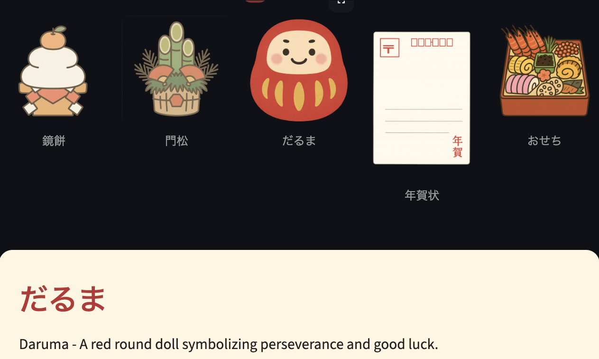

# 🎍 Japanese New Year Decorations Viewer

An interactive **Streamlit app** to explore traditional **Japanese New Year (Oshōgatsu)** decorations.  
Click on an image to learn its meaning in English — from *Kagami Mochi* to *Daruma*, each item has deep cultural symbolism in Japan’s New Year celebration.

---

## 🏮 Features

- 🖼️ Five main decorations: **Kagami Mochi**, **Kadomatsu**, **Daruma**, **Nengajo**, and **Osechi**
- 🧧 Clickable images — tap an item to reveal its meaning
- 🎨 Soft washi-paper background for a traditional aesthetic
- 🌐 All item data stored in a simple `items.json` file (easy to extend)
- 💡 Built with **Python + Streamlit**

---

## 🧩 Project Structure

